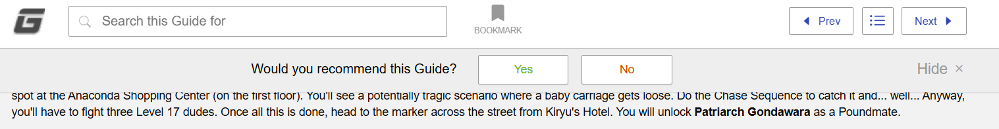

# GameFAQs Guide Banner Hider

A Tampermonkey userscript to permanently hide the intrusive "Would you recommend this Guide?" banner on GameFAQs guide pages, saving screen space and reducing clutter.

## Screenshot

## Features
* **Zero Flash:** Uses CSS to prevent the banner from flashing on the screen during page load.
* **Layout Preserved:** Replicates native site scripts to ensure the page's header layout doesn't break or leave empty gaps when the banner is removed.

## Installation

*(Note: You must have a userscript manager like the [Tampermonkey extension](https://www.tampermonkey.net/) installed in your browser first.)*

**[▶ Click here to install the script automatically](https://github.com/KlausVorutsu/gamefaqs-banner-hider/raw/refs/heads/main/gamefaqs-banner-hider.user.js)**

Alternatively, you can manually copy the code from `gamefaqs-banner-hider.user.js` and paste it into a new script in your Tampermonkey dashboard.
